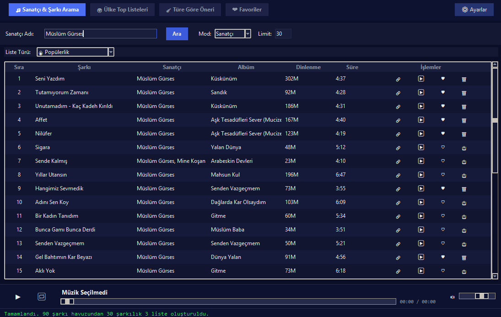
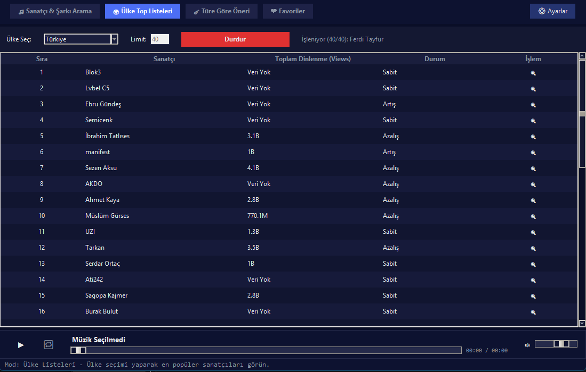
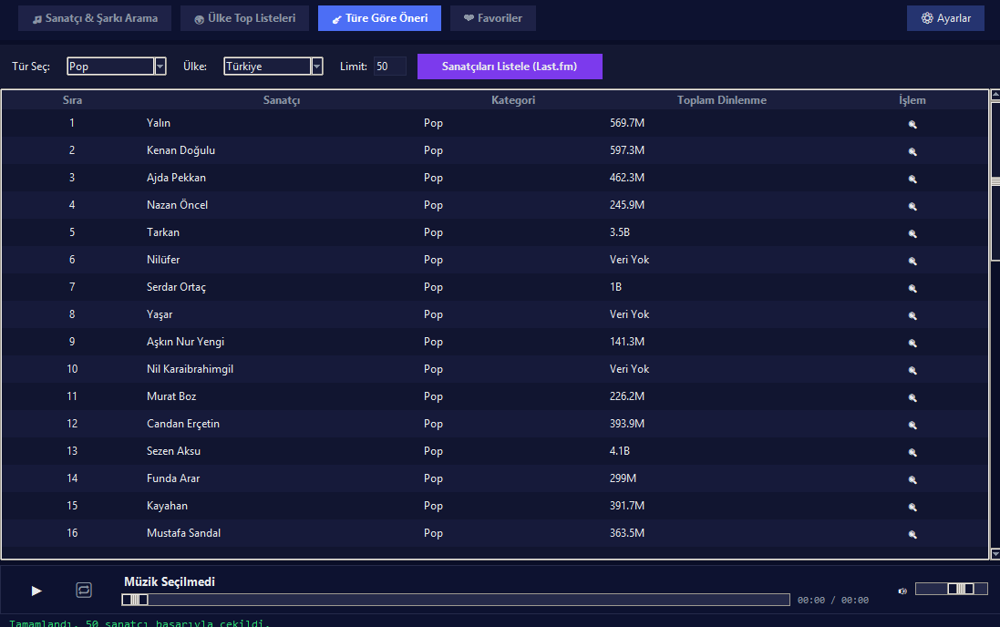
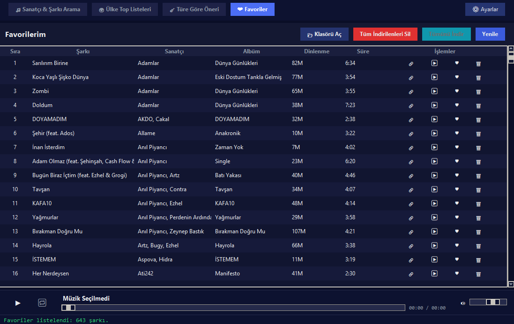

  

# 🎵 Playlister

YouTube Music üzerinden sanatçı/şarkı arama, ülke top listeleri, türe göre öneri, favori yönetimi, şarkı indirme ve gömülü müzik çalar sunan bir masaüstü uygulaması.

## ✨ Özellikler

- 🔍 **Sanatçı & Şarkı Arama** — YouTube Music veritabanında detaylı arama
- 🌍 **Ülke Top Listeleri** — 60+ ülkenin güncel müzik trendleri
- 🎸 **Türe Göre Öneri** — Last.fm entegrasyonu ile tür bazlı şarkı keşfi
- ❤️ **Favori Yönetimi** — Beğendiğin şarkıları kaydet, düzenle, filtrele
- ⬇️ **Şarkı İndirme** — Yüksek kalite ses indirme (AAC formatında)
- 🎧 **Gömülü Müzik Çalar** — Uygulama içi VLC tabanlı çalar
- 📝 **Otomatik Şarkı Sözü** — LRCLIB üzerinden senkronize sözler
- 🏷️ **Akıllı Metadata** — Kapak resmi, albüm, tarih bilgisi otomatik düzenleme

---

## 🚀 Kurulum

1. [**Releases**](https://github.com/lNyctophilia/Playlister/releases) sayfasından en güncel `Playlister_Setup.exe` dosyasını indirin
2. İndirilen setup dosyasını çalıştırın ve kurulumu tamamlayın
3. Masaüstü kısayolundan veya Başlat menüsünden **Playlister**'ı açın

> 💡 Kurulum sırasında gerekli tüm bağımlılıklar (VLC, FFmpeg, Visual C++ Runtime) otomatik olarak yüklenir. Ekstra bir şey kurmanıza gerek yoktur.

---

## 🎸 Last.fm API Key (Opsiyonel)

**Türe Göre Öneri** özelliğini kullanmak istiyorsanız ücretsiz bir Last.fm API anahtarı almanız gerekmektedir. API key olmadan da uygulama çalışır, sadece tür bazlı öneriler devre dışı kalır.

1. [Last.fm API Hesap Oluşturma](https://www.last.fm/api/account/create) sayfasına gidin
2. API uygulaması oluşturup API key alın
3. Uygulamayı açtıktan sonra **⚙ Ayarlar** bölümünden API key'inizi girin

> 💡 Uygulama içinde detaylı bir API key kurulum rehberi bulunmaktadır.

---

## 📹 Tanıtım Videosu & 📸 Ekran Görüntüleri

### 🎥 Uygulama Tanıtımı

---

### 🔍 Arama Ekranı

### 🌍 Top Listeler

### 🎸 Tür Önerileri

### ❤️ Favoriler

---

## 📄 Lisans

Bu proje **All Rights Reserved** lisansı altındadır. Kodun kopyalanması, dağıtılması, değiştirilmesi veya ticari amaçlarla kullanılması **yasaktır**. Detaylar için [LICENSE](LICENSE) dosyasına bakınız.

